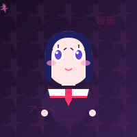

  

  

  

## 🛠️ Công nghệ và Công cụ 🛠️

  
  
  
  
  
  
  
  
  
  
  
  
  

## 🎮 Về tôi

- 🌟 Tôi là một lập trình viên đam mê phong cách anime và pixel art
- 🎨 Tôi thích tạo ra các trải nghiệm trực quan và sáng tạo
- 🕹️ Game dev là một trong những sở thích chính của tôi
- 💻 Tôi làm việc với: JavaScript, HTML5, CSS3, React, Pixel Art tools

## 📊 Thống kê GitHub 📊

  
  

## 🎯 Dự án nổi bật

### 🎮 Pixel Art Game
Một trò chơi phong cách pixel art với các nhân vật anime đáng yêu.

### 🖌️ Pixel Art Creator
Công cụ trực tuyến để tạo pixel art theo phong cách anime.

### 🌐 Anime Blog
Blog chia sẻ về anime và pixel art.

## 🎯 Khóa học của tôi 🎯

  

**🌸 [KHÓA HỌC] ANIME PIXEL ART • Lớp học thiết kế nhân vật anime pixel art chuyên nghiệp ✍ | Thiết kế, Hoạt hình, Game Dev**

**🌸 Đây là khóa học mà mình đã làm cực kỳ tâm huyết, với phong cách dạy thiết kế anime pixel art chuyên nghiệp. Giúp các bạn có thể thiết kế các nhân vật pixel art theo phong cách Nhật Bản đẹp mắt.**

**🌸 Mình chỉ nhận số lượng rất ít học viên để đảm bảo chất lượng, nên các bạn quan tâm có thể liên hệ với mình sớm để đăng ký giữ chỗ nhé!**

**🔗 Video giới thiệu chi tiết: [Xem tại đây](https://your-video-url.com)**

**🔗 Bài viết chi tiết: [Xem tại đây](https://your-blog-post-url.com)**

**🔗 Liên hệ Facebook: [Facebook của tôi](https://facebook.com/YOUR_FACEBOOK)**

**📧 Hoặc Email: your-email@example.com**

  

## 📑 Châm ngôn yêu thích 📑

  

## 👽 Kết nối với tôi 👽

  
  
  
  
  
  

## 📖 Dự án chính của tôi 📖

  
  

  
  

  

<!-- Hãy thay thế YOUR_USERNAME bằng tên người dùng GitHub của bạn -->
<!-- Hãy thay thế YOUR_FACEBOOK, YOUR_YOUTUBE, YOUR_LINKEDIN, YOUR_INSTAGRAM bằng tên người dùng của bạn trên các nền tảng tương ứng -->
<!-- Hãy thay thế your-email@example.com bằng địa chỉ email của bạn --> 