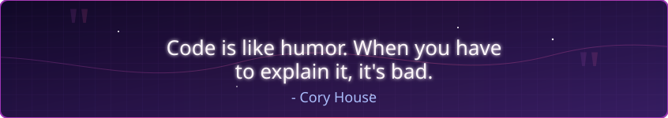

  

  

  

 

  
  
  

 

## 🛠️ Công nghệ và Công cụ 🛠️

  
  
  
  
  
  
  

  
  
  
  
  
  
  

 

## 🧑‍💻 Về tôi

- 🚀 Full Stack Developer với đam mê phát triển các ứng dụng web hiện đại
- 🔍 Chuyên về MERN Stack (MongoDB, Express.js, React, Node.js)
- 🌐 Đam mê tạo ra trải nghiệm người dùng mượt mà và trực quan
- 💼 Luôn tìm kiếm cơ hội để học hỏi và phát triển kỹ năng

 

## 📊 Thống kê GitHub 📊

  
  

  

 

## 📑 Châm ngôn yêu thích 📑

  

  <i>"Nỗ lực luôn được đền đáp xứng đáng"</i>

